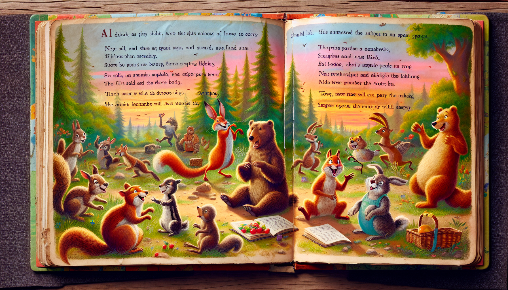

# StoryVerse AI

Welcome to **StoryVerse AI**! This innovative media application leverages state-of-the-art AI models to turn your input into a unique visual and auditory experience. Generate captivating stories with images, text, and audio effortlessly.

<p align="center">
  
</p>

## Features

- **DALL·E-3 Image Generation:** Transform textual input into a series of imaginative images using the DALL·E-3 model.
- **GPT-4 Turbo Text Generation:** Craft engaging stories based on user input and generated images with the power of GPT-4 Turbo.
- **Text-to-Speech Integration:** Convert your generated stories into immersive audio experiences using advanced Text-to-Speech technology.
- **Clarifai Integration:** Leverage Clarifai for additional image analysis or content moderation, enhancing the overall user experience.
- **Streamlit User Interface:** Enjoy a user-friendly interface powered by Streamlit for seamless interaction.
- **Usage Limits:** Users can generate free stories and images three times. After reaching the limit, they need to provide their own Clarifai PAT key for continued usage.

## Getting Started

1. **Clone the Repository:**
   ```bash
   git clone https://github.com/Jaweria-B/Media-App.git
   cd Media-App
   ```

2. **Install Dependencies:**
   ```bash
   pip install -r requirements.txt
   ```

3. **Run the App:**
   ```bash
   streamlit run app.py
   ```

4. **Open Your Browser:**
   Visit [http://localhost:8501](http://localhost:8501) to explore the app.

## Usage

1. Input your desired content through the app's user interface.
2. Witness the creativity of DALL·E-3 as it generates a series of images.
3. Experience the power of GPT-4 Turbo crafting a unique story based on the provided input and generated images.
4. Listen to your story in audio format with the Text-to-Speech feature.
5. Explore the images, read the story, and listen to the audio for a complete multimedia experience.

## Contributing

Contributions are welcome! If you have ideas for improvements, feature requests, or find any issues, feel free to open an issue or submit a pull request.

## Acknowledgments

- Special thanks to OpenAI for providing cutting-edge AI models.
- [Clarifai](https://www.clarifai.com/) for their image recognition capabilities.
- [Streamlit](https://www.streamlit.io/) for the intuitive user interface.

## Contact

For inquiries, reach out to bjaweria509@gmail.com.

Enjoy creating and exploring unique stories with StoryVerse AI!
